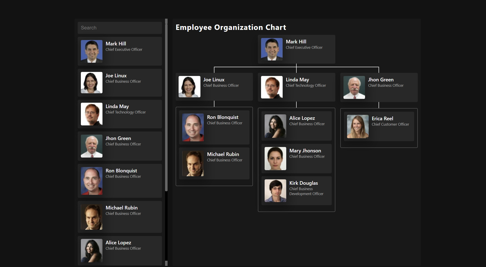

# HappyFox Frontend Assignment - Planets fact site solution

This is a solution to the HappyFox_Frontend_Assignment.

## Table of contents

- Frontend Mentor - Employee Organization Chart
  - Table of contents
  - Overview
    - The challenge
    - Screenshot
    - Links
  - My process
    - Built with
    - What I learned
    - Continued development
  - Author

## Overview

### The challenge

Users should be able to:

- Visualize an employee organization chart
- Update an employee organization chart interactively with filtering and drag & drop functionality.

### Screenshot

### Links

- Live Site URL: [@netlify.app](https://sidlimboo-happyfoxassignment.netlify.app)

## My process

### Built with

- [vite](https://vitejs.dev/) - JS library
- [Styled Components](https://styled-components.com/) - For styles
- [MirageJs](https://miragejs.com/) - Dummy data
- [react beautiful dnd](https://github.com/atlassian/react-beautiful-dnd) - For drag and drop

### What I learned

This was a frist time that i used drag and drop in my project. I feel more confidence in the used of drag & drop and using mirage for dummy objects. I am really enjoying how mirage helped my replicate the flow of data similar to live enviroment. Likewise, I feel the file structure allows for more reusable and manageable code.

## Author

- Website - [Shidharth Limboo](https://shidharthlimboo.netlify.app/)
